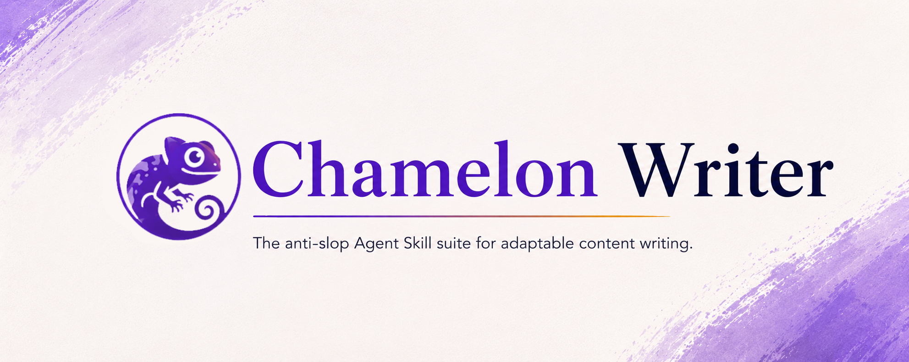

# Chameleon Writer

<p align="center">
  <a href="https://skills.sh"></a>
  <a href="./LICENSE"></a>
  <a href="./README.md"></a>
  <a href="./README.md"></a>
</p>

A portable Agent Skill Pack that eliminates AI Slop from writing. 12 skills in 3 composable layers: Core anti-slop tools, Tone skills (how it sounds), and Platform skills (where it goes).

## Install

### Project Installation (Local to current project)

```bash
# Install the full suite into the current project
npx skills add NguyenHungCuongg/chameleon-writer

# Install a single skill into the current project
npx skills add NguyenHungCuongg/chameleon-writer --skill slop-detector
```

### Global Installation (Available everywhere)

```bash
# Install the full suite globally
npx skills add NguyenHungCuongg/chameleon-writer --global

# Install a single skill globally
npx skills add NguyenHungCuongg/chameleon-writer --skill slop-detector --global
npx skills add NguyenHungCuongg/chameleon-writer --skill formal-executive --global
```

Or install into every supported agent harness globally:

```bash
npx skills add NguyenHungCuongg/chameleon-writer --global --agent '*'
```

## How It Works

**Three layers, composable.**

| Layer        | Skill                  | Purpose                                  |
| ------------ | ---------------------- | ---------------------------------------- |
| **Core**     | `anti-slop-core`       | Master anti-slop rulebook                |
| **Core**     | `slop-detector`        | Audit + score + rewrite existing content |
| **Core**     | `voice-fingerprint`    | Extract and apply personal writing style |
| **Tone**     | `formal-executive`     | C-suite voice, pyramid structure         |
| **Tone**     | `storyteller`          | Scene-first, narrative, concrete detail  |
| **Tone**     | `witty-conversational` | Direct, opinionated, earned humor        |
| **Tone**     | `eli5-explainer`       | Clear, non-patronizing simplification    |
| **Platform** | `tech-doc`             | Developer documentation, code-first      |
| **Platform** | `email-craft`          | Professional email, one ask              |
| **Platform** | `linkedin-post`        | LinkedIn posts, no hustle porn           |
| **Platform** | `twitter-thread-craft` | Twitter/X threads                        |
| **Platform** | `readme-writer`        | GitHub READMEs                           |
| **Platform** | `slide-script`         | Presentation speaker notes               |
| **Platform** | `brutal-editor`        | User-defined target cuts                 |

---

## Voice Fingerprint: Make Any Skill Sound Like You

1. Run `voice-fingerprint` with your own writing sample
2. Save the Voice Profile it generates
3. Paste it at the start of any skill session:

```
My Voice Profile:
[paste your Voice Profile here]

Now use [skill-name] to write: [topic]
```

The Voice Profile overrides the skill's default style — sentence rhythm, vocabulary, punctuation habits, register.

---

## License

MIT · Copyright (c) 2026 NguyenHungCuongg
