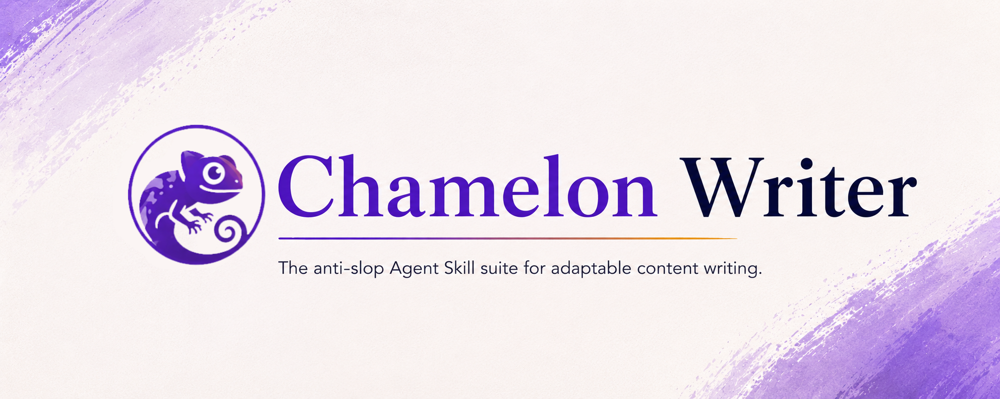

# Chameleon Writer

<p align="center">
  <a href="https://skills.sh"></a>
  <a href="./LICENSE"></a>
</p>

An agent skill pack that removes AI slop from writing. Install one skill or all of them. Works in any agent harness that supports the skills.sh format.

## Install

### Project installation (local to current project)

```bash
# Install the full suite into the current project
npx skills add NguyenHungCuongg/chameleon-writer

# Install a single skill into the current project
npx skills add NguyenHungCuongg/chameleon-writer --skill slop-detector
```

### Global installation (available everywhere)

```bash
# Install the full suite globally
npx skills add NguyenHungCuongg/chameleon-writer --global

# Install a single skill globally
npx skills add NguyenHungCuongg/chameleon-writer --skill slop-detector --global
npx skills add NguyenHungCuongg/chameleon-writer --skill formal-executive --global

# Install into every supported agent harness globally
npx skills add NguyenHungCuongg/chameleon-writer --global --agent '*'
```

## Quick start

```
/slop-detector

Paste your draft here and I'll score it and rewrite it.
```

```
/voice-fingerprint

[paste 2-5 paragraphs of your own writing]
```

```
My Voice Profile:
[paste your Voice Profile here]

Now use linkedin-post to write: [topic]
```

## Skills

14 skills in 3 layers. Skills are standalone: install one, get one, no cross-dependencies.

| Layer    | Skill                  | Purpose                                  |
| -------- | ---------------------- | ---------------------------------------- |
| Core     | `anti-slop-core`       | Master anti-slop rulebook                |
| Core     | `slop-detector`        | Audit + score + rewrite existing content |
| Core     | `voice-fingerprint`    | Extract and apply personal writing style |
| Tone     | `formal-executive`     | C-suite voice, pyramid structure         |
| Tone     | `storyteller`          | Scene-first, narrative, concrete detail  |
| Tone     | `witty-conversational` | Direct, opinionated, earned humor        |
| Tone     | `eli5-explainer`       | Clear, non-patronizing simplification    |
| Platform | `tech-doc`             | Developer documentation, code-first      |
| Platform | `email-craft`          | Professional email, one ask              |
| Platform | `linkedin-post`        | LinkedIn posts, no hustle porn           |
| Platform | `twitter-thread-craft` | Twitter/X threads                        |
| Platform | `readme-writer`        | GitHub READMEs                           |
| Platform | `slide-script`         | Presentation speaker notes               |
| Core     | `brutal-editor`        | User-defined target cuts                 |

## Voice fingerprint

Run `voice-fingerprint` on your own writing to get a Voice Profile. Paste that profile at the start of any skill session to override the skill's default tone with yours: sentence rhythm, vocabulary, punctuation habits, register.

## Feedback & contributions

Suggestions and bug reports:

- Open a Pull Request or Issue on GitHub,
- Contact via email [cuonghungnguyentop@gmail.com](mailto:cuonghungnguyentop@gmail.com).

## License

MIT - Copyright (c) 2026 NguyenHungCuongg
